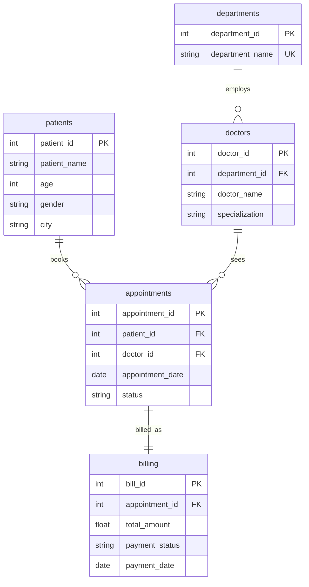

# Hospital Patient and Appointment Analytics

I put this together as a small portfolio piece: plain SQL files you can load into PostgreSQL, with a realistic mini schema and a set of reporting queries. No app, no ORM, just tables and questions you might actually ask about visits and billing.

**Stack:** PostgreSQL 14 or newer.

## What it covers

The data is simplified, but it behaves like a slice of a real hospital system: who the patients are, which department each doctor belongs to, scheduled visits with a status, and a bill tied to each visit. Revenue questions join billing to appointments so the month lines up with when the visit happened, not when someone typed in a payment.

## Schema (short)

| Table | Role |
|-------|------|
| `departments` | Department name (unique so labels stay clean). |
| `patients` | Name, age, gender, city. |
| `doctors` | Name, department, specialization. |
| `appointments` | Patient, doctor, date, status (`Completed`, `Cancelled`, `No Show`). |
| `billing` | One row per appointment, amount, paid or unpaid, payment date when paid. |

Foreign keys link doctors to departments, appointments to patients and doctors, and billing to appointments. `billing.appointment_id` is unique so you cannot accidentally double-bill the same visit in this model.

## Schema Diagram

How the tables connect at a glance. One department has many doctors, patients and doctors each tie to many appointments, and each appointment has at most one billing row in this design.



## SQL used in the queries

- Inner joins across three and four tables  
- `GROUP BY`, `HAVING`, `ORDER BY`, `LIMIT`  
- `COUNT`, `SUM`, `AVG`, and `COUNT(DISTINCT ...)`  
- `CASE` inside aggregates for rates  
- A `WITH` CTE for department revenue before picking the top row  

## Questions the queries answer

1. How many patients are registered?  
2. How many doctors are on staff?  
3. How many appointments does each department have?  
4. Which doctors have the most appointments?  
5. Which patients have more than one visit?  
6. What percent of appointments were cancelled?  
7. What is monthly paid revenue?  
8. Which bills are unpaid, and for whom?  
9. What is the average bill amount?  
10. Which department has the highest paid revenue?  
11. Which doctor saw the most distinct patients on completed visits?  
12. What are the five largest bills?  
13. How many appointments fall into each status?  
14. How many patients live in each city?  
15. What are the ten most recent appointments?  

## Files

```
schema.sql      -- drop (if present), create tables, constraints, indexes
insert_data.sql -- sample rows
queries.sql     -- analytics queries
README.md       -- this file (includes the schema diagram)
assets/         -- optional place for exported images or notes
```

## How to run it

1. Create a database, for example `hospital_analytics`.
2. Run the scripts in order:

```bash
psql -d hospital_analytics -f schema.sql
psql -d hospital_analytics -f insert_data.sql
psql -d hospital_analytics -f queries.sql
```

Or paste each file into psql, DBeaver, or another client in that same order.

## Notes from building it

Rerunning `schema.sql` drops the tables first, which saves time when you tweak things locally. The status and payment checks help keep inserts honest (for example paid rows always carry a payment date). With the sample loaded, you will see a few repeat patients and a mix of completed, cancelled, and no-show visits, plus both paid and unpaid bills, so the joins and filters have something to work with. I mainly used this to practice the kind of multi-table aggregates and filters that show up in real reporting work.
